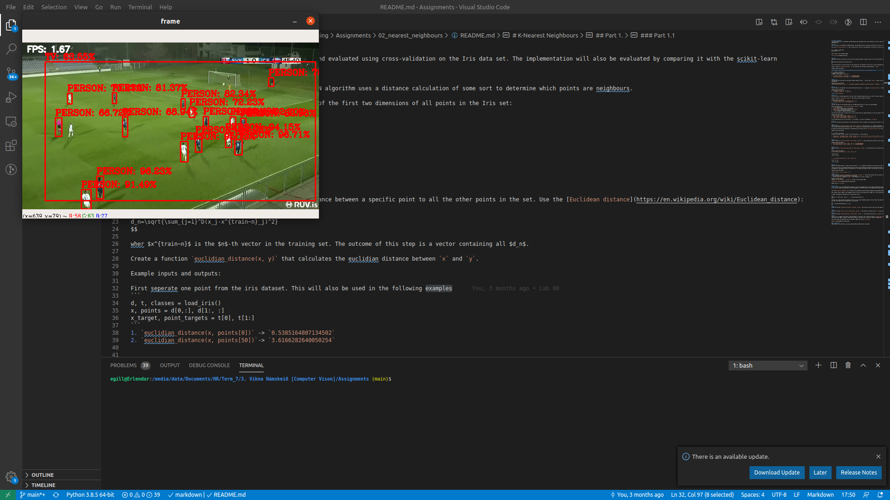

# Assignment 3: Object detection and recognition using CNNs

## Part I - Object detection using a pre-trained model

1. Use the DNN module in OpenCV (in the core library as of v3.4.x) to load a pre-trained network.
2. Capture images from the camera, and forward-pass it through the network.
3. Display the detected object bounding box and class in the live image.
4. Measure the frame rate achieved.  Compare using networks accepting two different image sizes.

    It makes almost no difference, as running the network on the model running time is the limiting factor.

5. Test on a live video feed (or by playing video on your phone) and roughly estimate the precision and recall.

    It is accurate, I rarely saw it misclassify although it did not always register items. e.g. if a person was running under an odd camera angle.
    It seams to have high precision and good recall.

    
    
    
    

### Note:
* You will find a tutorial using covering most of the above steps here: https://www.youtube.com/watch?v=GGeF_3QOHGE
* The tutorial uses a Darknet implementation of Yolo v3.

## Part II - Training your own network in Google Colab

1. Using Keras and Tensorflow, train a small network to classify a few sets of images (e.g. cats and dogs).  If necessary, reduce the number of epochs to allow training to finish in a few minutes.
2. What are the training results?

    loss: 0.3267 - accuracy: 0.8757 - val_loss: 0.7029 - val_accuracy: 0.7708

3. Write the resulting network to a file.
4. See if you can load your network into OpenCV.

    There is a conflict with the version of OpenCV's onnx loader and the keras2onnx converter.
    I got a model to convert on Windows that would fail on Ubuntu and could not be cross loaded.
    The version required&known to work has to be built from source.

5. Classify images from the camera, and measure the achieved frame rate.

    Using another model on my Windows desktop got 4x the performace of yolov3 for single detection

6. If the frame rate is different, what would be a likely explanation?

    It is about the same as the model takes up most of the running time.

### Notes:
* A tutorial covering most of these steps is found here: https://bleedai.com/training-a-custom-image-classifier-with-tensorflow-converting-to-onnx-and-using-it-in-opencv-dnn-module/ (Links to an external site.)
* The tutorial specifies particular versions of OpenCV and Tensorflow.  You can start by seeing if it works in the current version.
    
    It does not work and the version needed needs to be built from source. 

* Chapter 3 in Generative Deep Learning by David Foster, also provides a very clear tutorial description of the training.

Demonstrate the running code on your computer or submit a video.

Submit a link to the code in github or upload using the submit button.